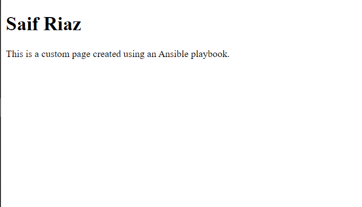

# Ansible Web Server Setup Playbook

## Description

This project demonstrates how **Ansible** can be used to automate the configuration of a web server on multiple target machines. Ansible allows us to control and configure servers remotely from a central machine (in this case, the **Ansible server**) to one or more **target servers**. In this project, the Ansible server is used to install and configure the **Apache web server** on the target server.

Ansible simplifies managing infrastructure and automating repetitive tasks by using **SSH** to communicate with target servers, eliminating the need for manual intervention. With a single playbook, you can apply configurations across many servers from a centralized location, making it efficient for large-scale deployments.

## Features

- Install Apache web server.
- Ensure Apache is running and enabled to start on boot.
- Create a custom `index.html` file for the web server.

## Prerequisites

Before running this playbook, ensure the following:

- Ansible is installed on your machine.
- SSH access is configured between your local machine and remote server.
- Your remote server should be running **Ubuntu**.
- **Password-less SSH** authentication is set up.

## Installation and Setup

1. **Clone the Repository:**

   Clone this repository to your local machine:

   ```
   git clone https://github.com/SaifRiaz3256/Ansible-practice-playbook.git
   cd Ansible-practice-playbook
   ```
   
2. **Configure Inventory:**

  Update the inventory.ini file with the details of your target server:
  ```
  [target]
  target ansible_host=<your_target_ip> ansible_user=ubuntu
  ```
3. Install Ansible (if not already installed):

  ```
  sudo apt update
  sudo apt install ansible
  ```

4. Run the Playbook:
  
  To apply the configuration, run the following command:
  ```
  ansible-playbook -i inventory.ini webserver.yml
  ```

This will install Apache, start the service, and deploy a custom index.html.

## Screenshot

Here is a preview of the custom Apache index page after deployment:



Directory Structure
```
Ansible-practice-playbook/
│
├── inventory.ini       # Inventory file for target servers
├── webserver.yml       # Ansible playbook for web server setup
├── README.md           # This readme file
└── other-files/        # Other relevant files (if any)
```
